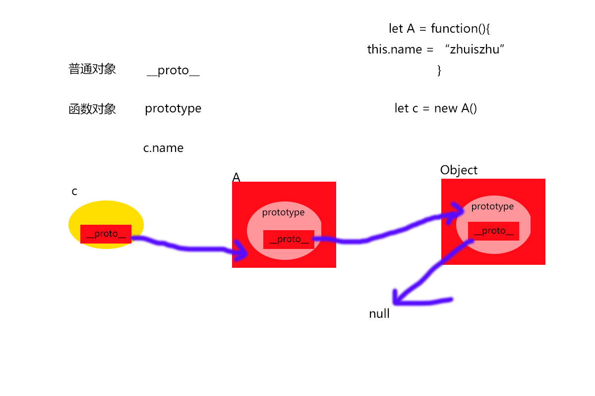

### 一、两种编程风格
#### 1、面向过程与面向对象
面向过程是具体化的，流程化的。解决一个问题，需要一步一步分析需要怎样，然后需要怎样，一步一步实现的。

面向对象是模型化的，抽象出一个类，这是一个封闭的环境，在这个环境中有数据有解决问题的方法，你如果需要什么功能直接使用就可以了，至于是怎么实现的，你不用知道。

从代码层面来看，面向对象和面向过程的主要区别就是数据是单独存储还是与操作存储在一起。在类的里边，实现具体的功能还是需要流程化、具体化的代码去实现的，在类里还是需要具体的算法来实现的。

总结来说面向对象的底层还是面向过程，面向过程抽象成类，然后封装，方便使用就是面向对象。
#### 2、优缺点
面向过程

>优点：性能比面向对象高，因为类调用时需要实例化，开销比较大，比较消耗资源;比如单片机、嵌入式开发、 Linux/Unix等一般采用面向过程开发，性能是最重要的因素。 
>
>缺点：没有面向对象易维护、易复用、易扩展

面向对象

>优点：易维护、易复用、易扩展，由于面向对象有封装、继承、多态性的特性，可以设计出低耦合的系统，使系统 更加灵活、更加易于维护 
>
>缺点：性能比面向过程低

#### 面向对象有三大特性，分别是封装性、继承性和多态性
### 二、封装
#### 1、创建一个类
通过构造函数创建类，通过函数内this变量添加属性和方法：
```js
var Book=function(id,name,price){
    this.id=id;
    this.name=name;
    this.price=price;
    this.getName=function(){
        return this.name
    }
}
```
通过原型添加共有属性和方法：
```js
Book.prototype={
    display:function(){
        //展示该书的方法
    }
}
```
通过this添加的属性和方法在每次实例化的时候都会创建一次，而所有的实例化对象都会公用一个prototype对象，prototype只会创建一次,prototype对象中的constructor指向的是Book构造函数


使用 new 关键字实例化对象并通过点语法使用对象的方法：
```js
var book=new Book(10,"javascript设计模式",59);
book.display()
```
#### 2、属性和方法的封装
私有属性、私有方法、公有属性、公有方法、特权方法、构造器、静态共有属性、静态共有方法、共有属性、共有方法的实现：
```js
var Book=function(){
    //私有属性
    var num=1
    //私有方法
    function checkId(){

    }
    //特权方法
    this.getName=function(){}
    this.setName=function(){}
    this.getPrice=function(){}
    this.setPrice=function(){}
    //公有属性
    this.id=id;
    //公有方法
    this.copy=function(){}
    //构造器
    this.setName(name)
    this.setPrice(name)
}
//静态共有属性
Book.type="学习教材"
//静态共有方法
Book.open=function(){

}
Book.prototype={
    //共有属性
    size:"297*210"
    //共有方法
    display:function(){
        //展示该书的方法
    }
}
```
私有属性：通过构造函数作用域直接写在构造函数里不能被外界访问到的变量

私有方法：通过构造函数作用域直接写在构造函数里不能被外界访问到的方法

公有属性：在类实例化时通过this创建的能被外界通过点语法访问到的属性

公有方法：在类实例化时通过this创建的能被外界通过点语法访问到的方法

特权方法：通过this创建的方法不仅能访问到公有属性和方法还能访问到私有属性和方法，所以也叫特权方法

构造器：实例化时通过调用特权方法初始化对象的属性，调用的这些方法可以看成构造器

静态共有属性:类通过点语法添加的属性，new实例化化时不会被执行到，所以实例化后的对象无法访问到，只能通过类的点语法访问

静态共有方法:类通过点语法添加的方法，new实例化化时不会被执行到，所以实例化后的对象无法访问到，只能通过类的点语法访问

共有属性：通过类的prototype创建的属性，实例化的对象的__proto__指向了原型对象prototype，对象在寻找属性的时候会通过__proto__一级一级向上寻找，所以通过prototype能被实例化的对象访问到，且所有的实例化对象共享一份prototype

共有方法：通过类的prototype创建的方法，原因共有属性
#### 3、类的静态变量的闭包实现
