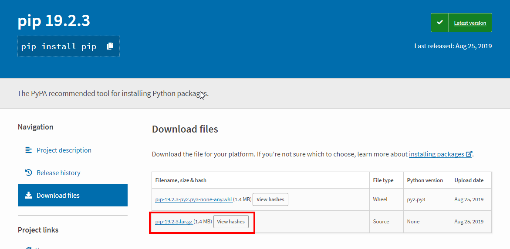
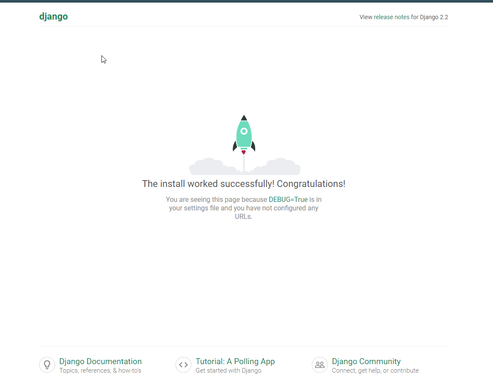

### 一、搭建环境
[Python下载地址](https://www.python.org/downloads/)

官网下载最新版Python并进行安装


安装过程基本保持默认即可，但是下图记得添加环境变量


安装完成后打开cmd，输入python -V 查看是否显示版本号，显示则说明python安装成功，否则可能需要在下图中手动添加两个环境变量地址，变量地址为：
>python安装地址 
>
>python安装地址/Script


在cmd中输入pip -V 检测pip是否安装成功，未成功则需要手动安装pip

[pip下载地址](https://pypi.org/project/pip/)



下载后解压，在解压文件夹运行cmd，输入 
```
python setup.py install
```
pip即安装完成，

添加pip到环境变量，地址为：
>python安装地址/Script

### 二、安装虚拟环境

为保证每个项目都有独立版本的包资源,不互相冲突，需要为项目建立虚拟的环境

**安装virtualenv**

打开终端，输入：

```
pip install virtualenv
```
**创建虚拟环境**
进入项目根文件夹，打开终端，输入：

```
virtualenv venv  //venv为虚拟环境的名字
```
**进入并启用环境**

在项目根文件夹，打开终端，输入：

```
cd venv/Script/
activate
```
**退出虚拟环境**
终端输入：
```
deactivate
```
### 二、创建项目及目录结构
在虚拟环境终端中输入：
```
cd ../../           //进入项目根目录
django-admin startproject HelloWorld  //HelloWorld为项目的名字
```
创建完成后我们可以查看下项目的目录结构：
```
HelloWorld
|
|-- HelloWorld
|   |-- __init__.py
|   |-- settings.py
|   |-- urls.py
|   `-- wsgi.py
`-- manage.py
```
>HelloWorld: 项目的容器。
>
>manage.py: 一个实用的命令行工具，可让你以各种方式与该 Django 项目进行交互。
>
>HelloWorld/__init__.py: 一个空文件，告诉 Python 该目录是一个 Python 包。
>
>HelloWorld/settings.py: 该 Django 项目的设置/配置。
>
>HelloWorld/urls.py: 该 Django 项目的 URL 声明; 一份由 Django 驱动的网站"目录"。
>
>HelloWorld/wsgi.py: 一个 WSGI 兼容的 Web 服务器的入口，以便运行你的项目。

接下来我们进入 HelloWorld 目录输入以下命令，启动服务器：

```
cd HelloWorld/
python manage.py runserver 0.0.0.0:8000
```
此时我们在浏览器中输入地址：127.0.0.1：8000，即可看到Django建立的服务了


http://upos-hz-mirrorks3u.acgvideo.com/upgcxcode/47/08/79620847/79620847-1-30080.mp4?e=ig8euxZM2rNcNbuBhwdVtWuBhwdVNEVEuCIv29hEn0l5QK==&deadline=1567196211&gen=playurl&nbs=1&oi=2004583628&os=ks3u&platform=html5&trid=37409b9518414e1a8c26f2c648694c4b&uipk=5&upsig=d16f98dfe0c281ff511c3c60fd22ef03&uparams=e,deadline,gen,nbs,oi,os,platform,trid,uipk&mid=0